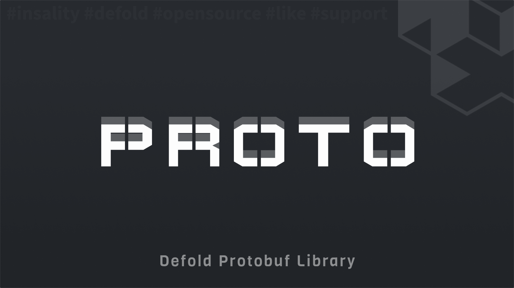

[](https://github.com/Insality/defold-proto/tags)
[](https://github.com/Insality/defold-proto/actions)
[](https://codecov.io/gh/Insality/defold-proto)

[](https://github.com/sponsors/insality) [](https://ko-fi.com/insality) [](https://www.buymeacoffee.com/insality)

# Proto

**Proto** - a [Defold](https://defold.com/) library for working with protocol buffers (_protobuf_ or _proto_). The library provides functions for encoding, decoding, and verifying protocol buffer messages. Verification is used to ensure that the lua table matches the protocol buffer definition. If the table data does not match the definition, the missing fields are set to default values, and the extra fields are removed. Verification also supports nested messages.

## Features

- **Encoding**: Encode a table with data to a binary string by proto definition.
- **Decoding**: Decode a binary string to a table with data by proto definition.
- **Verification**: Verify a table with data to match the proto definition.
- **Annotations**: Editor script to generate Lua annotations from proto files.

## Setup

### [Dependency](https://www.defold.com/manuals/libraries/)

Open your `game.project` file and add the following line to the dependencies field under the project section:

**[Defold Proto](https://github.com/Insality/defold-proto/archive/refs/tags/1.zip)**

```
https://github.com/Insality/defold-proto/archive/refs/tags/1.zip
```

After that, select `Project ▸ Fetch Libraries` to update [library dependencies]((https://defold.com/manuals/libraries/#setting-up-library-dependencies)). This happens automatically whenever you open a project so you will only need to do this if the dependencies change without re-opening the project.

### Library Size

> **Note:** The library size is calculated based on the build report per platform

| Platform         | Library Size |
| ---------------- | ------------ |
| HTML5            | **11.70 KB**  |
| Desktop / Mobile | **18.81 KB**  |


### Configuration [optional]

You can configure the **Proto** module in the `game.project` file:

```ini
[proto]
skip_default_nest_messages = 1
```

This configuration section for `game.project` file has the following options:

- **skip_default_nest_messages**: If the value is `1`, the module will skip the default values for nested messages. If the value is `0`, the module will set the default values for all nested messages. Default value is `0`. Since it's library additional feature, I want to give the ability to disable it.


### Proto File Paths

The Proto module uses the `.proto` files to define the protocol buffer messages. You can specify the paths to the proto files in a JSON file or a lua table. Here is an example of a JSON file:

```js
// /resources/proto.json
{
	"/resources/proto": [
		"game.proto"
	]
}
```

```lua
proto.init("/resources/proto.json")
```

Here is an example of passing a lua table directly instead of a JSON file:

```lua
proto.init({
	["/resources/proto"]: {
		"game.proto"
	}
})
```

The JSON file or lua table should have the following format:
- **Key**: The path to folder with proto files. This folder should be in the custom resources.
- **Value**: A list of proto file names in the folder.

The module uses `sys.load_resource` to load the files. Place your files inside your [custom resources folder](https://defold.com/manuals/project-settings/#custom-resources) to ensure they are included in the build.


### Proto File

The Proto module uses the `.proto` files to define the protocol buffer messages. Here is an example of a `.proto` file:

```proto
syntax = "proto3";

package game;

message data {
	string id = 1;
	uint32 number = 2;
	bool flag = 3;
	nested_data nested = 4;
}

message nested_data {
	string id = 1;
	uint32 number = 2;
}
```


## API Reference

### Quick API Reference

```lua
proto.init(config_or_path)
proto.get(proto_type)
proto.encode(proto_type, data)
proto.decode(proto_type, data)
proto.verify(proto_type, data)
proto.set_logger(logger)
```

### API Reference

Read the [API Reference](API_REFERENCE.md) file to see the full API documentation for the module.


## Use Cases

Read the [Use Cases](USE_CASES.md) file to see several examples of how to use the this module in your Defold game development projects.


## FAQ

Read the [FAQ](FAQ.md) file to see the frequently asked questions about the module.


## License

This project is licensed under the MIT License - see the [LICENSE](LICENSE) file for details.


## Issues and Suggestions

For any issues, questions, or suggestions, please [create an issue](https://github.com/Insality/defold-proto/issues).


## 👏 Contributors

<a href="https://github.com/Insality/defold-proto/graphs/contributors">
  
</a>


## ❤️ Support project ❤️

Your donation helps me stay engaged in creating valuable projects for **Defold**. If you appreciate what I'm doing, please consider supporting me!

[](https://github.com/sponsors/insality) [](https://ko-fi.com/insality) [](https://www.buymeacoffee.com/insality)

