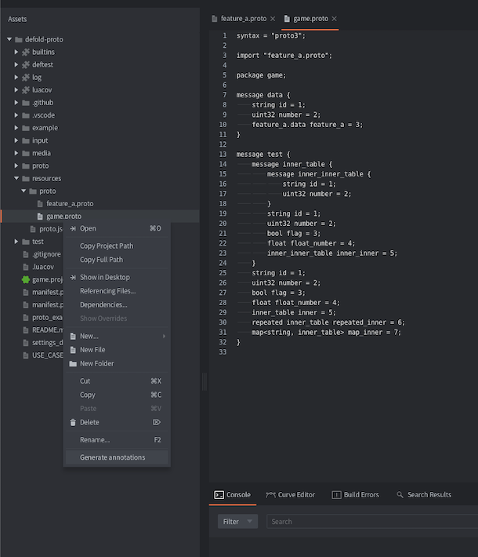
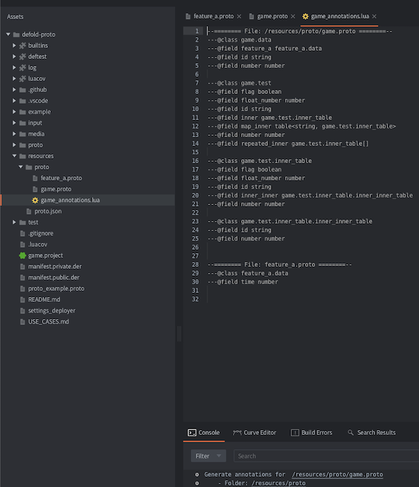

# Use Cases

This section provides examples of how to use the `proto` module.


## Using annotation generation from proto files

Defold Proto goes with the editor script which allows you to generate a Lua annotations from the proto files.

To generate the annotations, you need to right click on the proto file and select `Generate Annotations` from the context menu.

> Right click on *.proto file -> Generate Annotations



> Annotations generated for all included proto files



Next step is to place this annotations somethere in your project, but don't keep them in custom resources folder to avoid including them in the build.


## Define Your Game Data Format

I use proto files to define the game data format. This allows me to have a single source of truth for the game data format and use it in both the client and server code.

It enables the generation of Lua annotations from the proto files and provides autocomplete for the game data. It also ensures that the data is up to date with the proto file through message verification.


## Use Proto Data as Migrations

If you have a game state described with proto, you can add and remove fields from the proto file and use the proto module as a migration tool.

Use the `proto.verify` function to ensure that the data is up to date with the proto file.

```lua
-- Assume there is a game.proto with a game.data message:
-- message data {
--  string foo = 1;
--  string new_value = 2; // New field
-- }

local game_state = { foo = "bar", old_field = 2 } -- Game state Lua table
local verified_game_state = proto.verify("game.data", game_state)
-- Now verified_game_state is up to date with the proto file
print(verified_game_state.foo) -- prints "bar"
print(verified_game_state.new_value) -- prints empty string: ""
print(verified_game_state.old_field) -- prints nil
```


## Using Default Values

In proto, you can define default values for fields:

```lua
-- Assume there is a game.proto with a game.data message:
-- message data {
--  string foo = 1;
--  string new_value = 2 [default = "default_value"]; // New field with a default value
-- }

local game_state = { foo = "bar" } -- Game state Lua table
local verified_game_state = proto.verify("game.data", game_state)
-- Now verified_game_state is up to date with the proto file
print(verified_game_state.foo) -- prints "bar"
print(verified_game_state.new_value) -- prints "default_value"
```

Escape default `true` value for boolean fields; it will convert to `true` if the field is not set or is equal to false.

For more examples, see `/test/test_proto_default_values.lua`.

Even though it is possible to set default values, I prefer to use proto without them. In this case, I always know which values will be set on proto message creation.

- The `string` field will be an empty string.
- The `number` field will be 0.
- The `boolean` field will be false.


## Using Float or Double Fields

When using a float field for encoding, you may encounter precision loss. To avoid this, you can use a double field instead of a float.